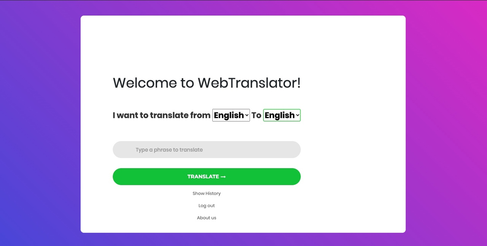
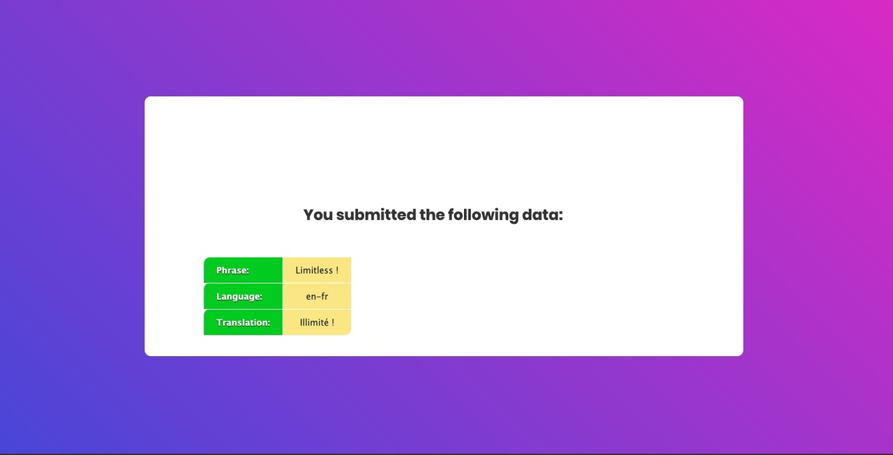
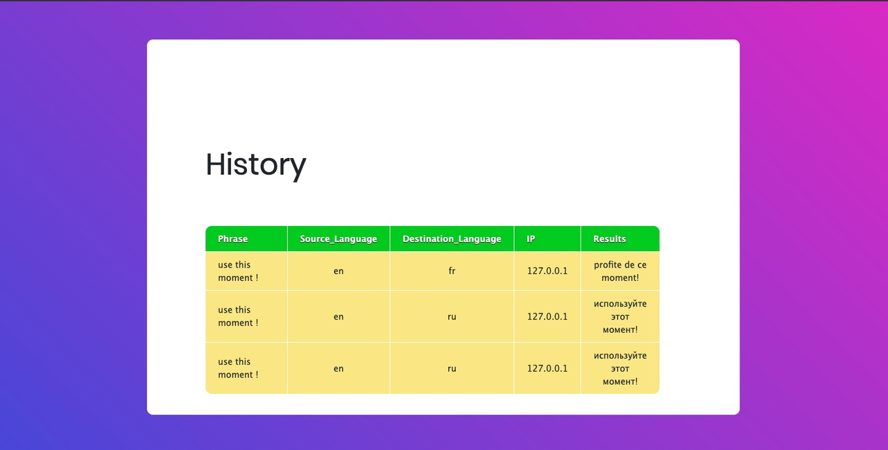
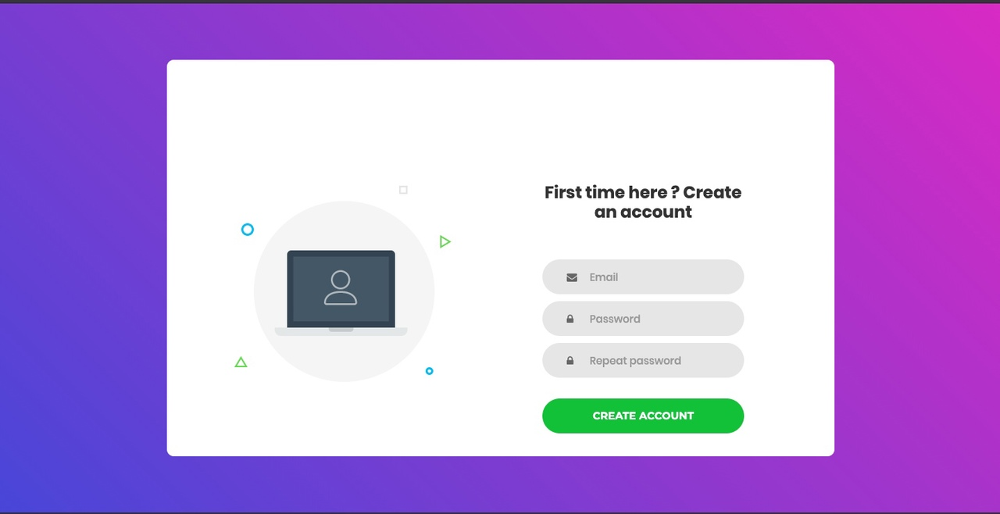

# Final project
Итоговый проект 

Тема проекта:
 - WebTranslator c кэшированием данных
 
 Описание проекта:
Многопользовательское веб-приложение с использованием Google API,позволяющее получить перевод введеного слова, текста на любой из 1000 языков

Ключевые особенности:

- многопользовательский режим ( реализован механизм сессий). Для каждого пользователя сохраняется информация о результатах запросов

- кэширование данных ( слово или текст переведнные ранее берутся из БД(redis), кэширующей результаты запросов:
  Это позволяет:
    - уменьшить нагрузку на сервер ( mysql) 
    - повысить производительность приложения (данные берутся из mysql только в том случае ,если они не были запрошены ранее. Во всех остальных случаяъ- из redis. А там они хранятся в виде hash сета)
    - значительно сократить количество обращений к Google API ( уменьшаем нагрузку на сервера Google)
    - обойти дневной лимит по количеству переводов ( 10 000 в день)
    
- интуитивно понятный и приятный пользовательский интерфейс

   
 
Стек технологий: 
 - Pyhton3
 - Pyramid (фреймворк)
 - Redis ( кэширование данных)
 - Google API (переводчик)
 - MySQL (БД)
 - jinja2 ( шаблонизатор)
 - html/css/javascript/
 
 Процесс установки:
1. Любым удобным способом скачать zip-файл web_project.zip
2. Распаковать данный архив
3. Перейти в директорию Web_Project 
4. C помощью python3 запустить файл Web_translator.py командой : python3 Web_translator.py
5. Готово

